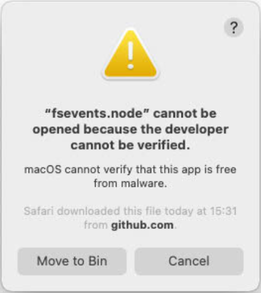
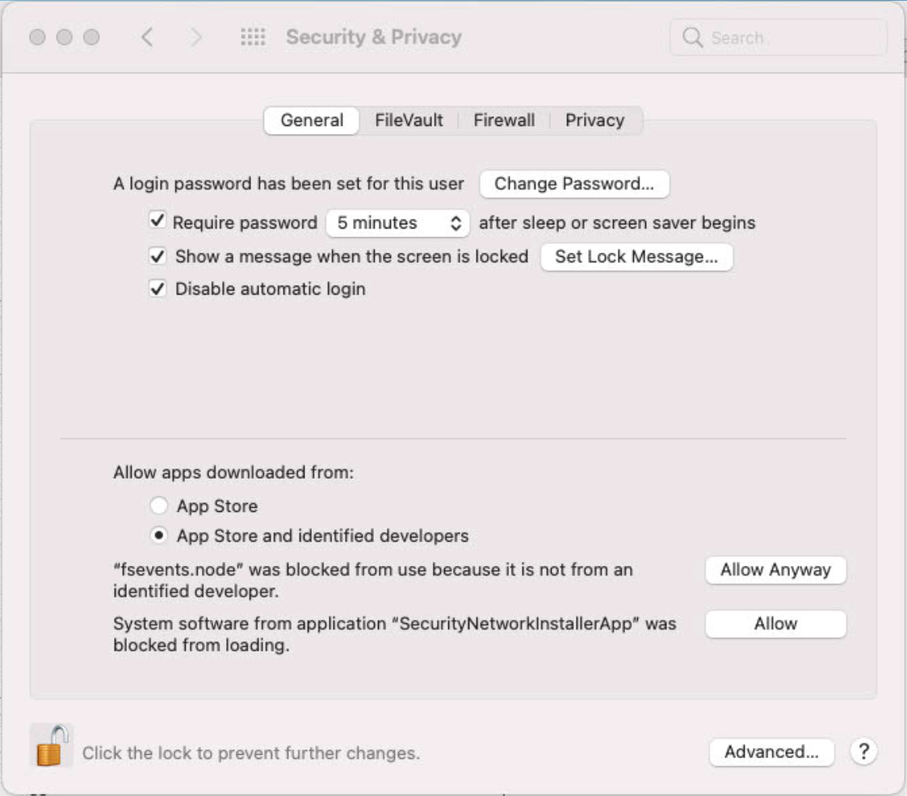
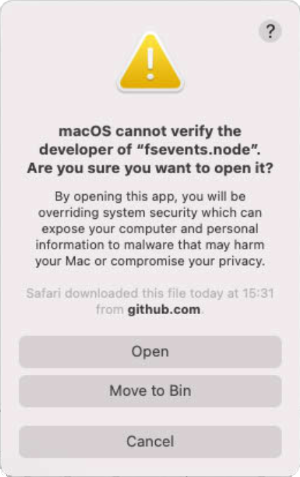

.. _installation:

Download and installation
=========================

Overview
--------

MARTi consists of two main components:

* a back-end which performs the analysis and can be a single desktop/laptop or a high performance cluster.
* a lightweight web-based front-end which allows users to view analysis results.

Make sure you've read the :ref:`intro` and know whether you are installing MARTi in a local configuration (analysis performed on a laptop/desktop) or an HPC configuration (analysis performed on an HPC Cluster).

Both components are contained within a single GitHub repository. You need to copy the MARTi software onto any computer that will be running the MARTi Engine (back-end) or the MARTi GUI (web server). If running in local mode, this will be the same computer. If running in an HPC mode, you will copy the software on to the cluster and also onto the computer where you will be running the web server for the GUI. For simplicity, it is not necessary to separate the Engine from the GUI for installation purposes.

If you would rather use a pre-installed image, we also provide a :ref:`Docker image <docker>`.

Prerequisites
-------------
In order to run the MARTi Engine (back-end), you also need to install the following on the machine where it will be running:

* **BLAST (2.12.0 or greater)** - `download from NCBI <https://blast.ncbi.nlm.nih.gov/Blast.cgi?CMD=Web&PAGE_TYPE=BlastDocs&DOC_TYPE=Download>`_ or, optionally, install with `homebrew on Mac <https://brew.sh>`_. On Ubuntu, using apt-get may install an older version. In which case, it may be easiest to download executables from the NCBI link above.
* **BLAST databases** - what you'll need will depend on what you're trying to do, but you might want to start with the nt database (:ref:`See Blast database installation information here <blastdbs>`).
* **NCBI taxonomy** - you can `download this from the NCBI taxonomy FTP site <https://ftp.ncbi.nlm.nih.gov/pub/taxonomy/>`_. You need the taxdump files, specifically the nodes.dmp and names.dmp files.
* **Java Run Time Environment (OpenJDK 16.0.2 or greater)** - the simplest option is to `install OpenJDK <https://openjdk.java.net>`_. Note, on Macs, the documentation for OpenJDK isn't great. Once you download the JDK, you need to move the directory into /Library/Java/VirtualMachines (`as described here <https://java.tutorials24x7.com/blog/how-to-install-openjdk-14-on-mac>`_). Or install with `homebrew <https://brew.sh>`_ (use brew install openjdk).

If you want to use Centrifuge or Kraken2 to classify reads, these will also need to be installed and available on the path. As with BLAST, you can use any database built for these tools (either by downloading one directly, or building your own following the tools' instructions):

* **Centrifuge** - prebuilt binaries are available `here <https://ccb.jhu.edu/software/centrifuge/>`_, or it can be built from source from `GitHub <https://github.com/DaehwanKimLab/centrifuge>`_.
* **Kraken2** - download `here <https://ccb.jhu.edu/software/kraken2/>`_ or on `GitHub <https://github.com/DerrickWood/kraken2>`_.

In order to run the MARTi GUI, you also need to install the following on the computer where it will be running:

* **Node.js (14.17.5 or greater)** - you can download it from `nodejs.org <https://nodejs.org/en/download/>`_. NPM, a package manager for Node.js packages, is included with the Node.js installation and therefore doesn't need to be installed separately. On Ubuntu, using apt-get may install an older version. In which case, see `the Installation instructions here <https://github.com/nodesource/distributions/blob/master/README.md#debinstall>`_.

If you are only running the GUI on a particular computer, you do not need to install the Engine dependencies. If you are only running the engine on a particular computer, you do not need to install the GUI dependencies. If you are running both the Engine and the GUI on a single computer, then you need to install both sets of dependencies on that computer.

Downloading
-----------

The easiest way to keep up to date with MARTi is to clone the GitHub repository. To do this, go to the command line, change into a convenient directory and then type:

``git clone https://github.com/richardmleggett/MARTi.git``

Alternatively, you can `visit GitHub <https://github.com/richardmleggett/MARTi>`_ and download a zip file with everything in it.

MARTi Engine (back-end) installation
------------------------------------

Having copied the MARTi software onto the computer or cluster being used for the back-end, you need to perform a couple of additional actions.

The marti script inside the bin directory is used to launch MARTi Engine. Open this in a text editor and change line 6 to point to the location of the bin directory containing MARTiEngine.jar, e.g.:

``MARTI_DIR=/Users/leggettr/Documents/github/MARTiEngine/bin``

Then move this marti script into somewhere in your search path. For Macs, this might be /usr/local/bin - e.g.:

``mv bin/marti /usr/local/bin``

Finally, you need to create an options file in your home directory that is required by the Engine. An example is provided in the bin directory. To copy it to your home directory, type:

``cp bin/marti_engine_options.txt ~/``

More details on what this file contains is provided in :ref:`cmdline`.

You can then check the MARTi Engine is installed by typing:

``marti -h``

If you see the help text, all is ok.

MARTi GUI (front-end) installation
----------------------------------

Having copied the MARTi software onto the computer or cluster being used for the back-end, you need to perform a couple of additional actions.

The marti_gui script inside the bin directory is used to launch MARTi GUI. Open this in a text editor and change line 4 to point to the location of the ``gui`` directory e.g.:

``MARTI_DIR=/Users/leggettr/Documents/github/MARTi/gui``

Then move this marti_gui script into somewhere in your search path. For Macs, this might be /usr/local/bin - e.g.:

``mv bin/marti_gui /usr/local/bin``

The GUI also requires the ``marti_engine_options.txt``. If you've already copied this to your home directory for the MARTi Engine then you can skip this step. Otherwise, copy it to your home directory, type:

``cp bin/marti_engine_options.txt ~/``

This file contains the locations of some important directories and you will need to update these for your system installation:

* TaxonomyDirectory - the location of NCBI taxonomy data (i.e. the directory containing nodes.dmp and names.dmp).
* MinKNOWRunDirectory - path to the directory containing sequencing runs to be analysed by MARTi. The data for each run directory within the MinKNOWRunDirectory should be in fastq format inside a directory called ``fastq_pass``, ``pass``, or ``fastq``. For example, if your MinKNOWRunDirectory is set to the following: ``/Users/peeln/Documents/data`` and you want to analyse a run called ``Flongle_run_11102022`` then the full path to the pass read data for that sample could look something like this: ``/Users/peeln/Documents/data/Flongle_run_11102022/20221011_1041_X2_AMT909_e26da2dd/fastq_pass`` or simply: ``/Users/peeln/Documents/data/Flongle_run_11102022/pass``
* MARTiSampleDirectory - the location of a directory that contains, or will contain, MARTi output data. The MARTi GUI will monitor this directory for results to display.

Then install the GUI server dependencies by running the following command from inside the gui/UI/ directory (e.g. ``cd gui/UI``) :

``npm install``

To start the GUI server, type

``marti_gui --options [/path/to/marti_engine_options.txt]``

The following parameters are specific to the GUI:

``Port:`` Specify the port number to be used. Ignore this if unsure. The default port number is 3000.
``https:`` False by default. If true the path to ``Key:`` and ``Certificate:`` is required as well.

To view the GUI, open a browser and navigate to GUI's port. For example, if using the default port enter the following into the address bar:

``localhost:3000``

**macOS differences**

On some versions of macOS, you may get an error about fsevents.node the first time you run it:

To get rid of this, you need to go the Security & Privacy preferences window and click "Allow Anyway" next to the fsevents.node error.

After this, you may get an additional error:

Click on "Open" and hopefully that will be macOS's last warning!

BLAST database installation
---------------------------

See the :ref:`BLAST database installation page <blastdbs>`.
