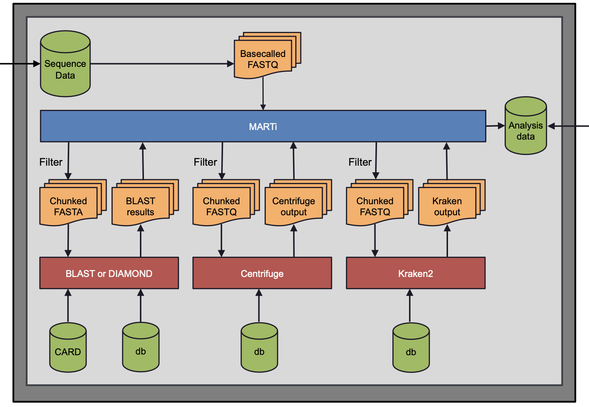

.. _intro:

Introduction
============
Overview
--------
MARTi consists of two main components:

* The **MARTi Engine** - a back-end which performs the analysis and can be a single desktop/laptop or a high performance compute (HPC) cluster.
* The **MARTi GUI** - a lightweight web-based front-end which allows users to view analysis results.

There are a number of possible ways to install MARTi, but in the following sections, we highlight the two most common:

#. a local analysis configuration where both the MARTi Engine and the MARTi GUI are installed on a single laptop/desktop.
#. an HPC configuration, where the MARTi Engine resides on an HPC and the MARTi GUI resides somewhere else - e.g. on a laptop/desktop.

Local analysis configuration
----------------------------

.. image:: images/ArchitecureLocal.png
  :width: 800
  :alt: MARTi local analysis configuration
  :align: center

In the local analysis configuration:

#. A sequencing device (e.g. MinION Mk1C or GridION) generates basecalled reads.
#. On a laptop or desktop computer, the **MARTi Engine** analyses the sequence data. It accesses the data either by mapping drives or rsync'ing the data over a network connection. 
#. On the same computer, the **MARTi GUI** provides a server which enables web browsers to access analysis. This could be a browser on the same computer, or any browser on the same network.

HPC configuration
-----------------

.. image:: images/ArchitectureHPC.png
  :width: 800
  :alt: MARTi HPC configuration
  :align: center

In the HPC configuration:

#. A sequencing device (e.g. MinION Mk1C or GridION) generates basecalled reads.
#. On the HPC system, the **MARTi Engine** analyses the sequence data. It accesses the data either by mapping drives or rsync'ing the data over a network connection. 
#. On a laptop or desktop, the **MARTi GUI** provides a server which enables web browsers to access analysis. This could be a browser on the same computer, or any browser on the same network.

Inside MARTi Engine
-------------------

The diagram above illustrates the processes that take place inside the MARTi Engine:

* Basecalled reads first pass through a prefilter which removes reads that don't meet a quality or length threshold.
* Remaining reads are batched into chunks for speedy analysis.
* By default, MARTi classifies reads with a combination of BLAST and its own Lowest Common Ancestor algorithm to assign reads to taxa. Centrifuge and Kraken2 can also be used as an alternative for lower powered systems.
* BLAST files are gzip compressed after analysis to reduce storage requirements.
* For AMR classification, MARTi uses BLAST and the CARD database.